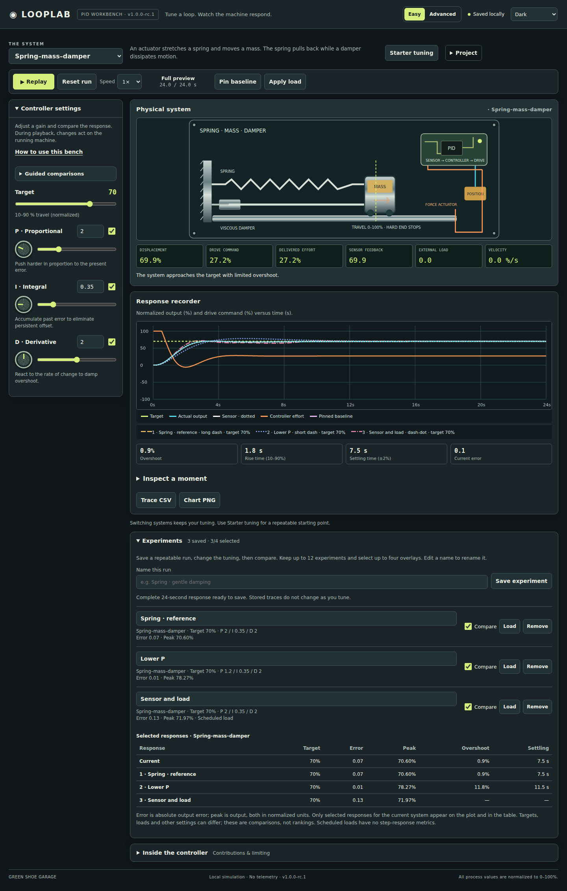
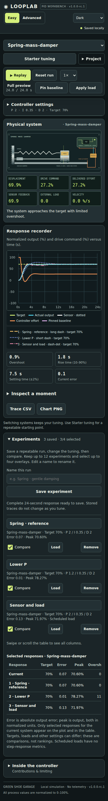
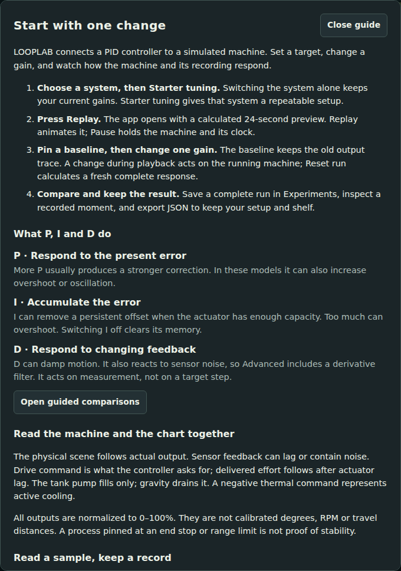
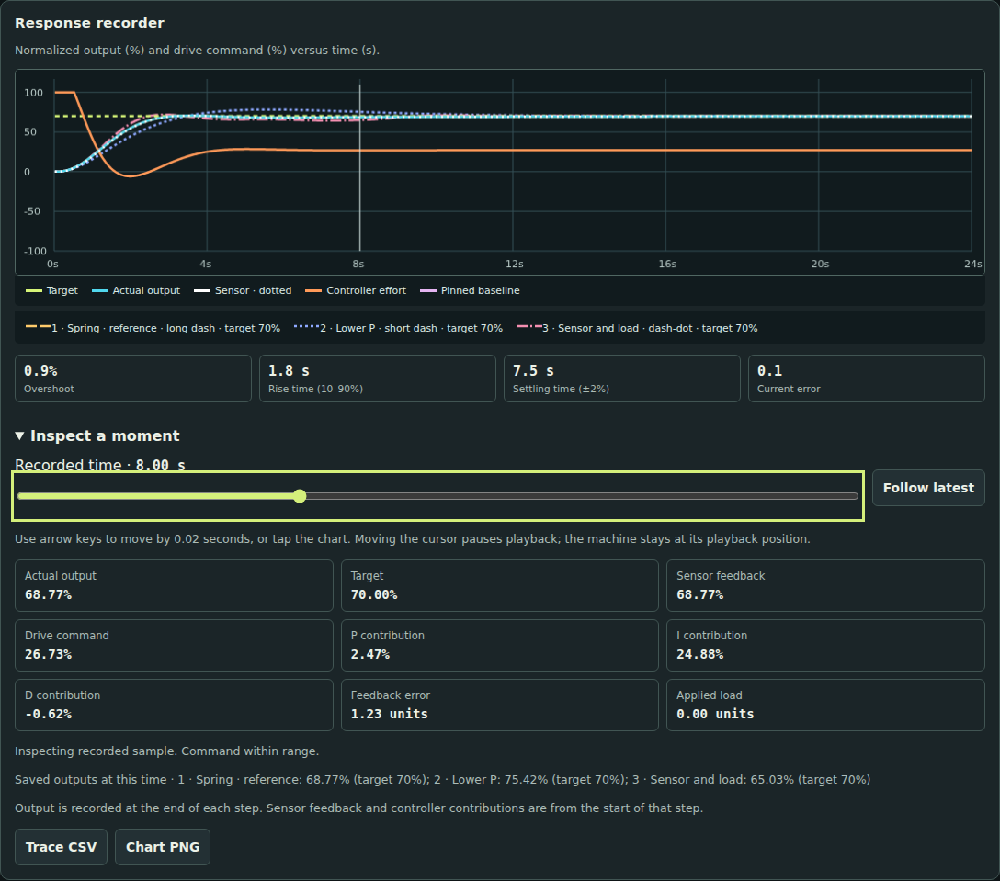
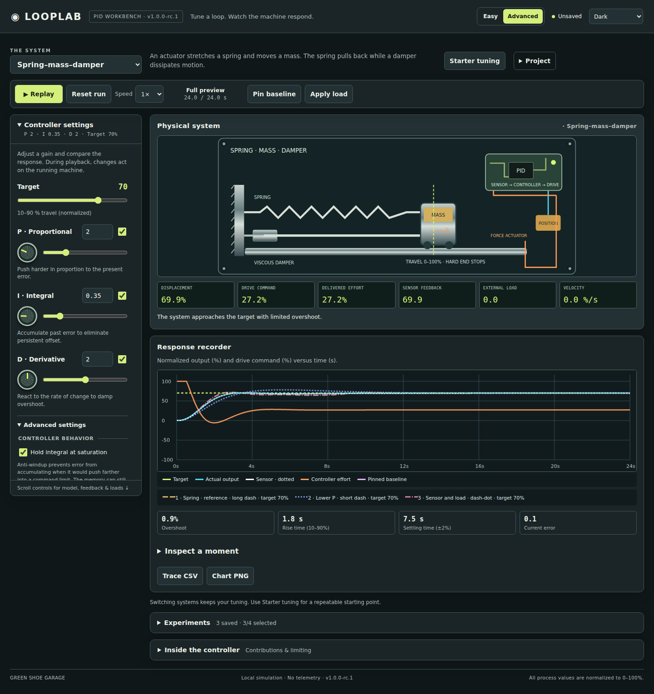
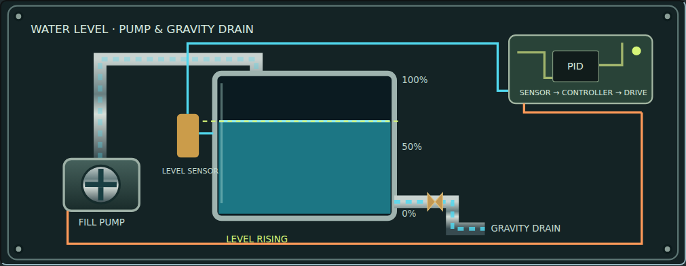
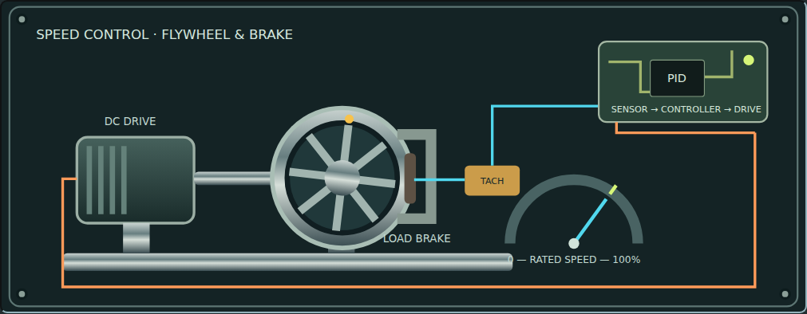
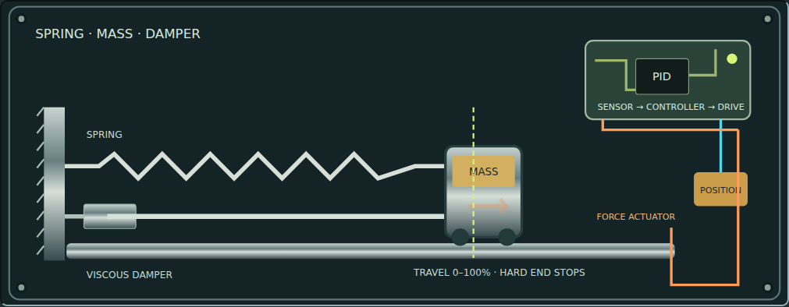

# LOOPLAB · PID Workbench v1.0.0-rc.1

An offline Green Shoe Garage instrument for seeing how PID tuning changes a physical system. The animated machine, output chart, and controller contribution chart all use the same simulation.

**Open `index.html` in a browser. No installation, build, account, network, or telemetry is required.** To host it, upload `index.html` to any static folder. Keep a local copy for offline reloads; this edition does not install a service worker for hosted pages.





## v1.0 release candidate

The core bench is complete: five physical models, guided comparisons, Advanced tuning, saved experiments, recorded-sample inspection and portable exports. This candidate adds an offline **Quick guide**, the [teaching guide](TEACHING-GUIDE.md), expanded [model validation](VALIDATION.md), and a fix that keeps model-boundary observations visible in mixed recordings and reports.

In Easy mode, choose **How to use this bench**. In either mode, choose **Project → Quick guide**. Opening it pauses playback. Escape or either close button returns to the bench; **Open guided comparisons** takes you to the existing Easy examples without changing the physical setup.

Chromium 153 passed the release workflows. Firefox page creation failed on the test host's process permissions, even on a blank page; WebKit could not launch because required host libraries were unavailable. These are unverified browser targets, not application passes or confirmed application failures. Safari, physical-device and full screen-reader checks remain open. No known release-blocking application defect was found in the completed checks.



## Inspection, exports and recovery (introduced in v0.9.0)

**Inspect → export → recover.** Open **Inspect a moment** below the response chart. Use the slider's arrow keys to move in 0.02-second steps, Home/End for the recording endpoints, or tap the chart to select the nearest sample. The cursor shows the chosen time; labeled values show actual output, target, sensor feedback, drive command, P/I/D contributions, error and load. Selected saved experiments also show their output at that time.

Moving the cursor pauses playback without moving the machine backward. The inspector reads the recorded samples, including when a paused edit has changed the current controller readouts. **Follow latest** returns the cursor to the newest sample; Resume advances playback. Starting a new run resets inspection to follow latest. Screen-reader slider values include time, output, target and command; the remaining values are ordinary labeled text, without continuous live announcements.

- **Trace CSV** downloads every sample in the current recording, including controller contributions, integral memory, unclipped command and limiting flags. It pauses playback and identifies partial versus complete recordings and whether settings changed. Saved overlays are kept in JSON, not this CSV.
- **Chart PNG** downloads a 1,440-pixel-wide chart with system, recording duration, version, axes, final gains, boundary-contact status and labeled line patterns for the visible baseline and saved responses. It pauses playback and omits the inspection cursor.
- **Project → Restore checkpoint** recovers the setup, pinned baseline and whole experiment shelf from just before the latest successful import or Fresh start. The timestamp and persistence status appear in Project. Restoring swaps the checkpoint with the current setup, so a second restore returns to it. Invalid imports do not replace the checkpoint.

A checkpoint survives reload when browser storage is available. It recalculates a full preview; partial playback, live edits as an event sequence, deleted-record undo and guide undo are not restored. Only one checkpoint is retained, and it is not included in JSON exports. If storage is full or blocked, the checkpoint remains available in the current tab and the UI says so. Keep exported JSON for a portable backup. Pending autosaves also flush when the page is hidden or left.



## Named experiments (introduced in v0.8.0)

**Tune → save → change → compare → reopen.** Open **Experiments** below the response recorder to keep up to 12 named experiments. Each stores its complete setup, a 24-second response, model revision and boundary-contact flag. Saving does not replace an earlier experiment.

1. Finish a run with fixed settings, or click **Reset run** to calculate a full preview. A fixed scheduled load is repeatable and can be saved. Partial recordings and runs whose settings changed during playback cannot be saved until recalculated.
2. Give the response a name and choose **Save experiment**. It is selected as an overlay if fewer than four are selected.
3. Change the tuning and save another response. **Compare** selects up to four saved output traces; line patterns, numbers and names identify each one.
4. Choose **Load** to restore an experiment's controller, model and disturbance settings and calculate a fresh preview. The stored response remains unchanged, as do your current theme, Easy/Advanced view and pinned baseline.

Only selected experiments for the active physical system appear on the chart and comparison table. Other selections remain remembered and count toward the four-overlay limit. The table compares current output with saved responses using target, absolute error, peak, overshoot and settling time. Scheduled loads and recordings modified during playback suppress step metrics. Targets and conditions are shown explicitly: a lower number is not automatically a better tuning.

Edit a saved name to rename it. Duplicate names are rejected. **Remove** offers one-step **Undo removal** until reload, import, Fresh start, another removal or undo. Undo never replaces a newer experiment with the same name. The full shelf is saved locally and included in JSON backups; the Print/PDF report includes selected same-system responses and their settings.

Project exports continue to use **format v4**. Importing a v4 file replaces the complete setup, baseline and experiment shelf. Importing an older v1/v2/v3 project retains your existing shelf. **Fresh start** explicitly clears the shelf after confirmation. Export before replacing or clearing work.

## Easy and Advanced (introduced in v0.7.0)

**Easy → choose a comparison → load → replay → change one gain.** The guided examples pin a reference response and calculate a second response that changes one gain. A short explanation below the chart compares the measured error and peak. The same simulation drives the physical scene and both plots.

| Guided comparison | System and change | What to watch |
| --- | --- | --- |
| P · A stronger push | Motor: P 0.6 → 2.4; I and D zero | Faster approach and less remaining offset; P alone does not reach the target |
| I · Remove the offset | Motor: I 0 → 0.8; P 1.6, D 0.12 | Integral action provides sustained effort to close the gap |
| D · Calm the motion | Spring: D 0 → 2; P 0.8, I 0.1 | Lower peak and reduced oscillation, without hitting an end stop |

**Load comparison** replaces the setup and the single pinned baseline. **Restore prior setup** restores the preceding settings and baseline and recalculates a complete preview; it does not restore a partially played recording. This one-step restore is available until reload, import, Fresh start, or use of the restore action. Loading another example makes that immediately preceding setup the restore point.

Changing a simulation setting removes the guided explanation, since its controlled comparison no longer applies. The pinned trace remains available for free tuning. Replay, theme changes, and mode switching preserve the comparison. Its setup and baseline survive autosave and JSON export/import.

**Advanced** exposes the physical model, sensor imperfections, loads and three new controller adjustments:

| Control | Range / default | Effect |
| --- | --- | --- |
| Derivative filter | 0.02–1 s / 0.12 s | Smooths the measured rate; a longer time constant adds filtering delay |
| P setpoint weight | 0–1 / 1 | P uses `Kp × (weight × target − feedback)`; I uses the full error |
| Integral memory cap | 0–1000 unit·s / 350 | Limits accumulated error before multiplication by Ki; zero prevents an I contribution |
| Hold integral at saturation | On / default on | Conditional anti-windup; the memory cap remains active when switched off |

Switching Easy/Advanced changes the view only: it preserves settings, baseline and playback position. Easy displays a reminder if custom model/controller conditions are active. New installations open in Easy; earlier projects without a mode open in Advanced. On desktop, Advanced controls scroll within the bench; phones retain normal page scrolling. **Starter tuning** resets the new controller adjustments to their defaults.



## Quality foundation from v0.6.1

The preceding audit release established these retained behaviors:

- Playback and run time are visible in a sticky toolbar.
- Controller settings collapse on phones so the physical system appears in the first screen; collapsing them on desktop reclaims the workspace width.
- Gains have exact numeric entry, functioning drag knobs, keyboard sliders and nearby term switches.
- Paused edits immediately update controller contributions and the current command without advancing the machine.
- Physical parameters, sensor settings and scheduled loads are grouped separately.
- The controller inspection panel is collapsible; Project holds import/export, reports and Fresh start.
- Invalid or future-format imports are rejected without changing the experiment. Damaged saved settings recover to defaults with a downloadable copy of the original data.
- Reports pause the run, identify the recording time and explain when the configuration changed midstream.

See [AUDIT.md](AUDIT.md) for the findings, fixes, validation and remaining limitations.

## Five physical systems

| System | What you can see | What determines its response |
| --- | --- | --- |
| Motorized cart | Carriage, motor shaft, threaded drive, encoder | Inertia and velocity drag |
| Thermal chamber | Heater coil, thermal mass, cooling fan, thermometer | Heat input, active cooling, heat loss |
| Water tank | Pump, inlet flow, water level, gravity drain | Pump flow, tank capacity, nonlinear gravity drainage |
| Motor & flywheel | Rotating flywheel, brake, tachometer, speed needle | Motor torque, rotational inertia, speed drag |
| Spring–mass–damper | Stretching spring, moving mass, damper and force arrow | Mass, spring stiffness and damping |





## First experiment

1. Choose a machine and click **Starter tuning**. This loads suitable gains, restores a 70% target, and removes noise, delay and disturbances. Switching machines by itself preserves your tuning.
2. Change P, I or D. A completed 24-second response recalculates immediately.
3. Click **Replay** to watch the machine and traces evolve. Pause/resume preserves the physical state; speed options range from ½× to 4×.
4. Change gains or the target while playing to see the running system react. Such runs are marked Mixed run rather than reporting single-step metrics.
5. Pin a baseline before tuning. Baselines belong to a specific system and are hidden when another system is selected, then shown again when you return.

The response chart is directly below the machine. The **Inside the controller** panel below it shows separate P, I and D traces, signed contribution meters, integral memory, command limiting and anti-windup status. Each term can be switched off. Disabling I clears its memory.

## Imperfect systems

Choose **Advanced**, then open **Controller settings → Advanced settings** for:

- Inertia, thermal inertia, tank capacity or mass, as appropriate.
- Actuator lag, sensor noise, feedback delay and command capacity.
- Spring stiffness/damping or tank drain coefficient when those models are selected.
- A scheduled disturbance with editable start, duration and signed magnitude.

Noise is uniform and uses a fixed seed, so restarting reproduces the same noise sequence. Delay applies to sensor feedback. The dotted white sensor trace can differ from the cyan actual output; the physical scene always uses the actual state.

**Apply load** adds a manual opposing load. Manual and scheduled loads add together; chart markers show their transitions. Changing the schedule restarts the preview. Other parameter changes during playback act on the running experiment.

The tank pump command is **0 to the chosen positive limit**: it cannot remove water. Gravity drainage removes water after an overshoot. The other systems use symmetric positive/negative commands. A newly reduced command limit can take time to affect delivered effort because of actuator lag.

## Playback and interpretation

The app opens with a calculated **Full preview**. Replay animates the same experiment; Reset run calculates a fresh full preview with the current settings. An explicit clock distinguishes preview, running, paused and complete states. Playback pauses when the tab enters the background.

Turning a knob vertically or editing its number changes the same gain as its slider. On a paused run, contributions update immediately but time and physical position stay fixed. Step-response metrics are marked Mixed run after live changes. A settling time shown with an asterisk during playback is provisional. Reaching a model boundary produces a visible explanation instead of implying unconstrained stability.

## Data and recovery

- Settings, one pinned baseline and up to 12 named experiments autosave in this browser's localStorage, with a visible status indicator.
- Export JSON for a portable backup; importing does not overwrite your original file.
- Imports are limited to 8 MB and validate numeric types/ranges, known versions, and bounded, ordered baseline samples before changing any state.
- JSON project format v4 includes the experiment shelf. Formats v1/v2/v3 remain accepted; missing controller fields retain the original defaults. Older LOOPLAB builds cannot import v4 projects; retain original backups if you need to use an older build.
- Project → Fresh start restores the initial cart setup and clears the baseline and saved experiment shelf after confirmation.
- Project → Print / PDF opens a report with settings, model assumptions, response metrics and both charts. Use its Print button to print or save a PDF.
- If saved settings fail validation, defaults open and the original data is retained as a recovery copy. The download remains available on later reloads.
- Changing browser, origin, profile or clearing browser storage can remove local settings. JSON is the durable backup.

## What the numbers mean

Every process is normalized to 0–100%. Temperature is a percentage of the model's thermal range, not calibrated degrees Celsius. Motor speed is a percentage of rated speed, not RPM. Scene rotation is slowed for visibility.

Rise time is 10–90% of the target. Settling requires at least one second continuously inside ±2% of the target (minimum 0.5 unit band), through the current recording end. Current error is actual output relative to target. Timed or live-modified runs do not display comparable step-response metrics. Models and numerical limitations are documented in [MODEL.md](MODEL.md).

## Verification and development

Numerical checks require Node.js only:

```sh
node tests/controller.cjs
node tests/references.cjs
```

Browser checks require Playwright and Chromium, solely for development:

```sh
npm install --no-save playwright
npx playwright install chromium firefox
node tests/browser.cjs
node tests/audit.cjs
node tests/learning.cjs
node tests/experiments.cjs
node tests/inspection.cjs
node tests/release.cjs
```

The release suite defaults to Chromium and Firefox. Set `BROWSERS=chromium` for the Chromium-only gate; use `BROWSERS=chromium,firefox,webkit` on a host with all three engines and their dependencies installed. WebKit on Linux is an engine check, not a physical Safari/iPhone test. A stalled release workflow fails after 150 seconds per engine.

To use an existing Chromium binary, set `BROWSER_EXECUTABLE` to its path. The test harness starts a temporary local server and writes screenshots, JSON and a PDF to a temporary directory. App users do not need any of these tools.

v1.0.0-rc.1 passed headless Chromium checks covering all five scenes, model controls, pause/resume, term switching, saved settings after reload, JSON round trips and legacy import, system-aware baselines, keyboard slider input, three themes, a 390px viewport, report generation, standalone-file offline reload, guided comparisons, one-step restore, mode preservation, new controller settings, named experiment capture/replay, immutable saved responses, four overlays, removal/undo, import validation, v1/v2/v3/v4 compatibility, exact sample inspection, CSV/PNG downloads, checkpoint restoration and storage-failure handling. No application page errors or external network requests were observed. See [TEST-REPORT.md](TEST-REPORT.md) for precise limits.

## Roadmap

- **v0.6.1 — Completed:** functional audit, recovery fixes and workbench polish.
- **v0.7.0 — Completed:** guided Easy mode, three repeatable comparisons and configurable Advanced controller behavior.
- **v0.8.0 — Completed:** named repeatable experiments, saved-response overlays and comparison reports.
- **v0.9.0 — Completed:** keyboard and touch response inspection, trace/chart exports, responsive inspector and persistent recovery checkpoints.
- **v1.0.0-rc.1 — Current:** completed teaching documentation, in-app help, 66 independent model cases, metric references and a reproducible release workflow. Chromium gate passed; other browser execution was blocked by the test host.
- **v1.0 stable:** complete Firefox and WebKit/Safari checks on a compatible host and resolve any application findings. Keep the existing project format compatible.
- **v1.x:** maintenance and targeted usability improvements driven by actual teaching use. Physical-device and screen-reader verification remain priorities; new models are deferred.

## License

Copyright © 2026 Green Shoe Garage. GNU GPL v3 or later; see [LICENSE](LICENSE).
